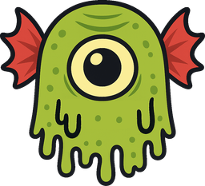

<a href="https://toxicfilter.com"></a>

# ToxicFilter example: plain PHP, no framework

A comment wall moderated with [ToxicFilter](https://toxicfilter.com), built with plain PHP, no framework and the PHP SDK ([toxicfilter/php-sdk](https://github.com/toxicfilter/php-sdk)). Somebody posts a comment and ToxicFilter decides:

- **allow**: it is published at once;
- **review**: it is held, and published or dropped when a person decides in ToxicFilter, which tells the app through a signed webhook;
- **block**: it is refused, and the author is told why in words.

If ToxicFilter cannot be reached, the comment is held rather than published unread. Comments are kept in a JSON file, so there is no database to set up and the moderation is the only code worth reading.

The walkthrough is on the blog: [toxicfilter.com/blog/moderate-comments-in-plain-php](https://toxicfilter.com/blog/moderate-comments-in-plain-php).

## Run it

```bash
composer install
TOXICFILTER_KEY=tf_test_... TOXICFILTER_WEBHOOK_SECRET=whsec_... php -S localhost:8000 -t public
```

The moderation is in [`public/index.php`](public/index.php). Requires PHP 8.1 with `ext-curl`.

## What you need

- A ToxicFilter key from your [dashboard](https://toxicfilter.com/keys). The free plan is
  enough. A `tf_test_` key is never charged and runs every free check, but never the model:
  use a live key to see what the model says.
- For the review flow, a webhook endpoint pointing at `/webhooks/toxicfilter` and its signing
  secret, from [Webhooks](https://toxicfilter.com/webhooks). On your machine, expose the app
  with a tunnel (`cloudflared tunnel --url http://localhost:8000`, for example) and use that
  address.

Both go in the environment as `TOXICFILTER_KEY` and `TOXICFILTER_WEBHOOK_SECRET`.

## The other examples

The same app with each client: [plain PHP](https://github.com/toxicfilter/php-example), [Flask](https://github.com/toxicfilter/flask-example), [Express](https://github.com/toxicfilter/express-example) and [Laravel](https://github.com/toxicfilter/laravel-example).

## Author

Created by [Edu Lazaro](https://edulazaro.com) for [ToxicFilter](https://toxicfilter.com), the moderation API it shows.

## License

This example is open-sourced software licensed under the [MIT license](LICENSE).
